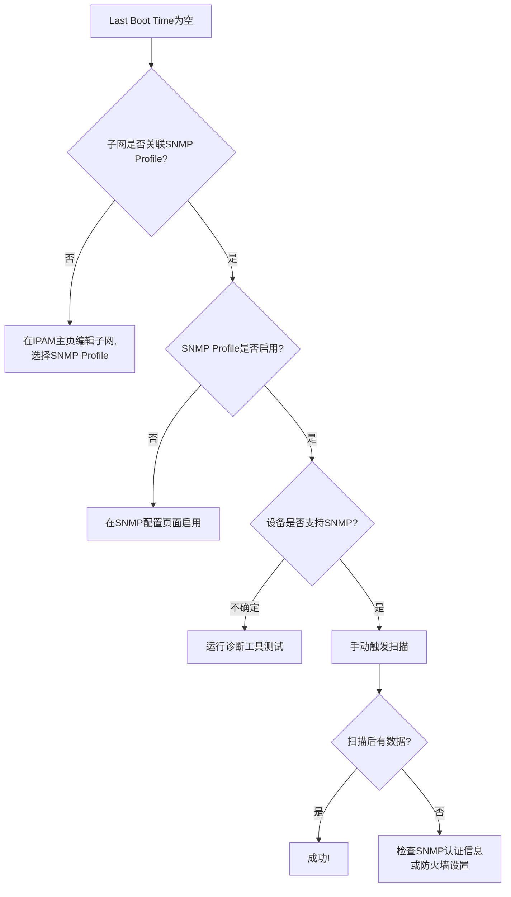

# 快速操作指南

## 1. 安装nmap（提升OS检测准确度）

### 一键安装
```bash
cd /opt/IP-Track
./install_nmap.sh
```

这个脚本会自动：
- 停止服务
- 重新构建包含nmap的backend镜像
- 启动服务
- 验证nmap安装

### 安装后效果
- **之前**: 只能根据TTL猜测（Linux/Windows/网络设备）
- **之后**: 精确识别（Windows 10/11, Ubuntu 20.04/22.04, CentOS 7/8等）

---

## 2. 检查SNMP Profile配置

### 检查当前状态
```bash
docker exec -it iptrack-backend python /app/check_snmp.py
```

这个脚本会显示：
- ✅ 所有SNMP Profile配置
- ✅ 哪些子网关联了SNMP Profile
- ✅ 有多少IP有Last Boot Time数据
- ✅ 最近的扫描记录

### 如果发现问题

#### 问题1: 子网未关联SNMP Profile
**解决**:
1. IPAM主页 → 编辑子网
2. SNMP Profile下拉框 → 选择对应的Profile
3. 保存
4. 点击"扫描"按钮重新扫描

#### 问题2: SNMP Profile未启用
**解决**:
1. 进入SNMP配置页面: http://10.56.4.137:8001/snmp-profiles
2. 编辑对应的Profile
3. 确认"启用状态"已勾选
4. 保存

#### 问题3: Last Boot Time仍然为空
**可能原因**:
- 设备不支持SNMP（普通PC/服务器默认不启用SNMP）
- SNMP认证信息错误
- 防火墙阻止UDP 161端口

**调试**:
```bash
docker exec -it iptrack-backend python /app/diagnose_ipam.py
# 按提示输入子网ID和设备IP进行测试
```

---

## 3. 验证Last Boot Time采集

### 步骤1: 确认配置
```bash
docker exec -it iptrack-backend python /app/check_snmp.py
```

输出示例：
```
找到 1 个SNMP Profile:

Profile ID: 1
  名称: Production_SNMP
  版本: SNMPv3
  用户名: monitor
  启用状态: 启用
  关联子网: 3 个
    - 10.71.192.0/24 (数据中心网络)
    - 10.71.194.0/24 (办公网络)
```

### 步骤2: 手动触发扫描
1. 打开IPAM主页: http://10.56.4.137:8001/ipam
2. 找到需要扫描的子网
3. 点击"扫描"按钮
4. 等待5-30秒（取决于子网大小）
5. 刷新页面

### 步骤3: 查看结果
进入子网详情页，检查Last Boot Time列是否有数据。

**注意**:
- Last Boot Time只对**支持SNMP的设备**有效（网络设备、启用了SNMP的服务器）
- 普通PC/工作站默认不启用SNMP，不会有Last Boot Time

---

## 4. 取消IP段详情页滚动

✅ **已完成** - 刷新浏览器即可看到效果

现在访问任意子网详情页（如 http://10.56.4.137:8001/ipam/subnets/67），会看到：
- 显示全部IP地址（无滚动）
- 页面会自然延伸显示所有内容

---

## 故障排查流程

### Last Boot Time为空



### 快速命令参考

```bash
# 检查SNMP配置
docker exec -it iptrack-backend python /app/check_snmp.py

# 完整诊断
docker exec -it iptrack-backend python /app/diagnose_ipam.py

# 安装nmap
cd /opt/IP-Track && ./install_nmap.sh

# 查看后端日志
docker logs iptrack-backend --tail 100 | grep -i snmp

# 重启后端
docker restart iptrack-backend
```

---

## 预期结果

### 配置完成后
| 功能 | 状态 |
|------|------|
| IP段详情页滚动 | ✅ 已取消，全部展示 |
| IPAM主页分页 | ✅ 默认200条/页 |
| OS检测 | ✅ 安装nmap后精确检测 |
| Last Boot Time | ✅ 网络设备正常显示 |
| DNS Hostname | ⚠️ 需配置DNS PTR |

### 示例：网络设备Last Boot Time
访问子网详情页，应该看到：

| IP Address | Status | DNS | Machine Type | Last Boot Time |
|------------|--------|-----|--------------|----------------|
| 10.71.192.1 | 🟢 | switch-core-1 | Cisco Catalyst 3850 | 2026-02-15 10:23:45 |
| 10.71.192.2 | 🟢 | switch-dist-2 | Dell S4048-ON | 2026-03-01 08:15:22 |

---

**创建日期**: 2026-03-18
**作者**: Claude Code Assistant
